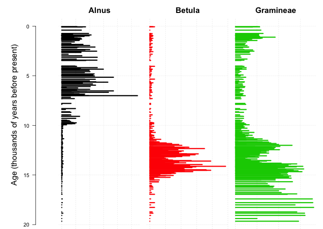
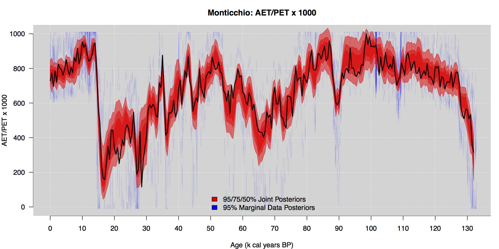
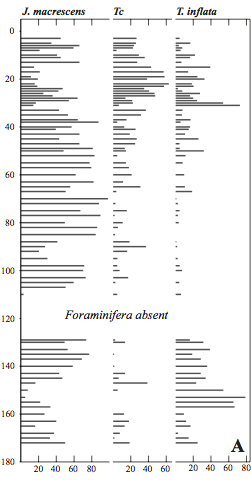
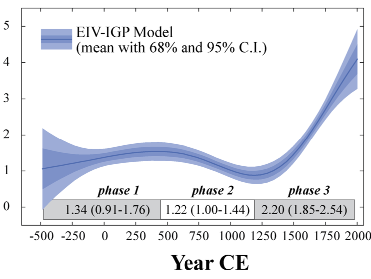

# Statistical palaeoclimate inference
Andrew C Parnell (also Judy Allen, Niamh Cahill, Thinh Doan, John Haslett, Ben Horton, Brian Huntley, Andrew Kemp, James Sweeney)  
2nd September 2015: 9am  

## Headline message 

1. Use hierarchical models to capture the data generating process and to account for climate change over time
2. Incorporate as much knowledge and data as you can about each step of the different processes
3. Account for uncertainty and be honest and open about your assumptions

## A grand research challenge

I want to create _a spatio-temporal palaeoclimate map of the world_ using:

- all available proxies
- physical knowledge of the climate system
- physical knowledge of the proxy response to changes in the climate system
- stochastic modelling of the unknowable remaining processes

The resulting map should have quantified uncertainties

## General approach

Idea: model the data generating process and constrain this with 'reasonable’ climate change

## Illustrations:

1. __Past climate change in Monticchio__. A reconstruction of three aspects of climate from a core in South-Central Italy going back ~120k years. The input data are 28 varieties of pollen from a sediment core with 924 counted layers. Ages are treated as known exactly for this core as it is laminated.
2. __Past sea level change in New Jersey__. A reconstruction of the rate of sea level change on the US East Coast based on foramnifera and $\delta^{13}$C values. The input data are 18 different species counts and $\delta^{13}$C values from two cores merged together. Also available are radiocarbon dates for the cores.

## Monticchio pollen inputs

## Monticchio climate outputs

## Monticchio technical details

Our model of the data generating process assumes that:

1. The _aspects of climate_ that are important are: the length of the summer, the harshness of the winter, and the amount of available moisture
2. The 28 pollen varieties we have chosen are _sensitive_ to these aspects of climate. We can try to learn how they change from a large modern set of data where we have both pollen counts and measures of these aspects of climate
3. The pollen is _measured_ (counted) by imperfect humans who have sliced up the core and occasionally mis-classify or mis-report count values. 

We call this set of assumptions the __forward model__ as it attempts to track the causal generation of the output pollen data from the input climate change

## New Jersey foramnifera inputs

## New Jersey sea level outputs

## New Jersey technical details

1. The _aspect of climate_ in which we are interested is the rate of relative sea level change
2. The 18 foramnifera varieties we have chosen are _sensitive_ to changes in sea level. We can try to learn how they change in response to changing sea level from a more recent set of data where we have both foramnifera counts and measures of changing sea level
3. The forams are _measured_ (counted) by imperfect humans who have sliced up the core and occasionally mis-classify or mis-report count values. They have also taken radiocarbon dates (similarly uncertain due to e.g. lab errors and contamination) to estimate the age of the counts

## Putting it all together

Bayes' theorem allows us to stitch all these different bits of the model together. The advantages include:

- The uncertainty will cascade down through the forward model to produce more accurate, more honest estimates of palaeoclimate uncertainty
- Multiple proxies (e.g. forams, $\delta^{13}$C and radiocarbon in New Jersey) can all be incorporated in a single hierarchical model
- Through the prior distribution we can constrain the proxy data to produce 'realistic' climate changes. For Monticchio (pollen) we use a stochastic volatility model to account for variability variability in climate over time. For New Jersey (sea level) we use an integrated Gaussian process so that we can model the uncertainty in the rate of sea level change
- We can create _climate histories_ which allow us to perform much richer inference on the past

## Why is this different from what has gone before?

- It doesn't purely rely on the individual core-slice by core-slice estimates which are usually noisy and can be constrained by _borrowing strength_ between the slices
- It models the data the correct causal way round (hence the _forward_ in forward model)
- It allows for probabilistic uncertainty on the climate outputs
- If the results look unreasonable you can go back and change your climate constraints!

## Other people’s work 

We are not the only people to propose or use this! See e.g.:

Tingley, M. P., Craigmile, P. F., Haran, M., Li, B., Mannshardt, E., & Rajaratnam, B. (2012). [Piecing together the past: statistical insights into paleoclimatic reconstructions](http://www.sciencedirect.com/science/article/pii/S0277379112000248). Quaternary Science Reviews, 35, 1–22.

Tolwinski-Ward, S. E., Tingley, M. P., Evans, M. N., Hughes, M. K., & Nychka, D. W. (2014). [Probabilistic reconstructions of local temperature and soil moisture from tree-ring data with potentially time-varying climatic response](http://link.springer.com/article/10.1007/s00382-014-2139-z). Climate Dynamics, 44(3-4), 791–806.

L. Holmström, L. Ilvonen, H. Seppä, and S. Veski. (2015.) [A Bayesian spatiotemporal model for reconstructing climate from multiple pollen records](http://www.e-publications.org/ims/submission/AOAS/user/submissionFile/19041?confirm=9f4da1fa). Annals of Applied Statistics, (_In press_)

## Computational issues

- It is hard but feasible to write down statistical models for all of the different components of the forward model. Finding an algorithm to fit this model can be extremely tough 
- There is lots of recent research in Bayesian computational methods, though these can be hard to understand and implement. Even when they work they can be very slow
- Evaluating the satisfactory performance of the fitting algorithm is another hard problem

## Model checking

- At a basic level, these models are impossible to validate. Parts of the model can be validated, e.g. that involving the modern data
- Some useful techniques include cross-validation (on both the modern and fossil data), posterior predictive checks, and model comparison using information criteria

## How far away am I from the grand challenge?

- I can do a reasonably good job of reconstructing aspects of palaeoclimate at individual sites. Others have extended to simple spatio-temporal models
- The forward models I am using are based on modern calibration data sets and so suffer from the well-known problems of modern analogues. This means I'm probably missing some important parts of the uncertainty (e.g. changing pollen response in different CO$_2$ regimes)
- I'm only able to use multiple proxies when they all respond to the same aspects of climate (e.g. forams and $\delta^{13}$C). I'm also assuming that the different species of the proxy respond approximately in the same way to climate changes
- The constraints on climate change use simple statistical models and no physical basis

## How can you get involved?
- Work together! We need climate modellers, proxy experts and statisticians
- If you are a proxy expert, think about the data generating process and how it can be broken down into pieces. Which pieces are well known, which pieces are uncertain? What other data might help inform the process? What other proxies might be useful?
- If you are a climate modeller, how can your model be simplified to provide quick and easy constraints on a climate history? How can uncertainty be incorporated into your model?
- If you are a statistician, how can you start to stitch these data sets together to make inferences in a reasonable computational time frame?

## Take home messages

1. Use hierarchical models to capture the data generating process and to account for climate change over time
2. Incorporate as much knowledge and data as you can about each step of the different processes
3. Account for uncertainty and be honest and open about your assumptions

## References

Parnell, A. C., Sweeney, J., Doan, T. K., Salter-Townshend, M., Allen, J. R. M., Huntley, B., & Haslett, J. (2015). [Bayesian inference for palaeoclimate with time uncertainty and stochastic volatility](http://onlinelibrary.wiley.com/doi/10.1111/rssc.12065/full). Journal of the Royal Statistical Society: Series C, 64(1), 115–138.

Cahill, N., Kemp, A. C., Horton, B. P., & Parnell, A. C. (2015). [Modeling sea-level change using errors-in-variables integrated Gaussian processes](http://projecteuclid.org/euclid.aoas/1437397101). The Annals of Applied Statistics, 9(2), 547–571.

Cahill, N., Kemp, A. C., Horton, B. P., & Parnell, A. C. (2015). A Bayesian Hierarchical Model for Reconstructing Sea Levels: From Raw Data to Rates of Change, [arxiv.org/abs/1508.02010](http://arxiv.org/abs/1508.02010)

This presentation available from [http://andrewcparnell.github.io](http://andrewcparnell.github.io)

